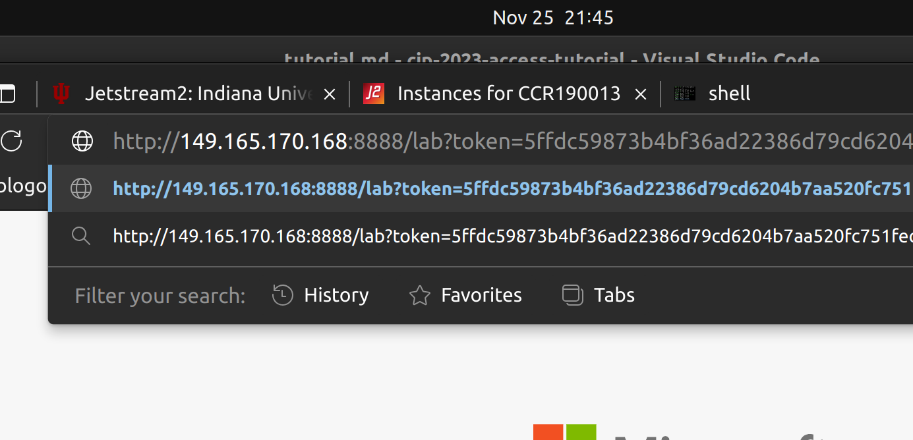

# SageMath and Macaulay2 on ACCESS

## Introduction

Computer algebra software (CAS) has become an indispensable tool in several areas of research and can be used to enhance the quality of teaching. Often, it provides computational evidence that leads to finding patterns, or for students, it provides another way of getting into mathematics. There is a collection of CAS such as CoCoa, Macaulay2, Magma, SageMath, and Singular to name a few. They are easy to install on a personal or Apple computer. However, due to the computation intensity, researchers often face limitations of memory, storage, or computing power. 

In the past two decades, there have been significant developments in computing resources, and several NSF awards have focused on expanding computing resources for academic research and education. 
Due to the complexity of getting into the server system or supercomputing platforms, these cutting-edge resources have not been fully utilized by the mathematics community. 
The primary goal of this tutorial is to present a streamlined procedure and demonstrate how to effectively use and monitor resources for SageMath and Macaulay2 on ACCESS. 

The tutorial will be particularly useful for those who do not have on-campus computing resources or run a summary program utilizing SageMath or Macaulay2, as the resources in this tutorial (ACCESS) are available for academic purposes at no cost. For questions, comments, or suggestions, please contact Youngsu Kim at youngsu.kim@csusb.edu. 

## How to contribute

Your feedback is invaluable and the main ingredient to maintain and improve this tutorial, and we encourage you to share your thoughts, suggestions, or any challenges you encountered. Feel free to reach out to [Youngsu Kim](youngsu.kim@csusb.edu) with your comments.

Thanks to ACCESS, the author has **some allocation for testers** (MTH230034). Feel free to contact me for testing allocations with your ACCESS account ID. Please refer to the [instructions](https://www.psc.edu/creating-an-access-account/) by the Pittsburgh Supercomputing Center. 

## Acknowledgments

This project started as part of the NSF-funded (#2230127) cyberinfrastructure professional training led by Dr. Mary Thomas at the San Diego Supercomputing Center. The author participated as a trainee for the year 2023 and has been serving as a high-performance faculty fellow at California State University San Bernardino. In addition to the PI, Dr. Thomas, the author appreciates the help and support from the mentors, especially Dr. Rick Wagner and Dr. Bob Sinkovits. 

The author thanks the ACCESS program for allowing the testing allocation MTH230034. 

## Content

- [Introduction](#introduction)
- [Acknowledgments](#acknowledgments)
- [Content](#content)
  - [Timeline](#timeline)
- [ACCESS Allocations](#access-allocations)
  - [Large Memory Nodes on ACCESS](#large-memory-nodes-on-access)
  - [Note on exchange requests and computing center hours](#note-on-exchange-requests-and-computing-center-hours)
  - [Multicore-Compute Nodes on ACCESS](#multicore-compute-nodes-on-access)
- [IU Jetstream2](#iu-jetstream2)
  - [SageMath on IU Jetstream2](#sagemath-on-iu-jetstream2)
  - [JupyterLab on IU Jetstream2](#jupyterlab-on-iu-jetstream2)
  - [Macaulay2 on IU Jetstream2](#macaulay2-on-iu-jetstream2)
  - [Monitoring resources on IU Jetstream2](#monitoring-resources-on-iu-jetstream2)
- [SDSC Expanse](#sdsc-expanse)
  - [SageMath and Macaulay2 on SDSC Expanse](#sagemath-and-macaulay2-on-sdsc-expanse)
  - [JupyterLab on SDSC Expanse](#jupyterlab-on-sdsc-expanse)
  - [Monitoring resources on SDSC Expanse](#monitoring-resources-on-sdsc-expanse)
  - [SageMath with Anaconda on SDSC Expanse](#sagemath-with-anaconda-on-sdsc-expanse)
  - [Singularity Container Definitions](#singularity-container-definitions)
    - [Macaulay2](#macaulay2)
    - [SageMath](#sagemath)
- [To-dos](#to-dos)

### Timeline

<!-- Tutorial:             15-20 minutes.
ACCESS Allocations:   The two entry level allocations has the processing time of 1-2 business days. It takes longer for the higher tiers.
Allocation Exchange:  Takes between 3-5 business days.
Setting up software:  5-10 minutes. -->

| Task                | Estimated                        |
|---------------------|----------------------------------|
| Tutorial            | 15-20 minutes                    |
| ACCESS Allocations  | 1-2 business days entry level, longer for higher tiers |
| Allocation Exchange | 3-5 business days                |
| Setting up software | 5-10 minutes                     |


## ACCESS Allocations

This tutorial focuses on [ACCESS](https://allocations.access-ci.org) and assumes that one has allocations on ACCESS. To request allocations on ACCESS (it is free, and the process is simple), please visit this [page](https://allocations.access-ci.org/prepare-requests-overview#comparison-table) for details. <!-- >>>> add more information about allocation tiers --> Once you have allocations, it is time to choose the supercomputing center(s) for your project.

On ACCESS, one submits an exchange request to use a supercomputing center. Here, we assume two scenarios:

1. Project requiring large memory
2. Project requiring many CPUs (cores)

### Large Memory Nodes on ACCESS

ACCESS provides a large-memory filter on its [webpage](https://allocations.access-ci.org/resources). As of 12/3/2023, these are the search results. Note that these nodes have at least 1TB of memory. If your memory requirement is modest, say about 100 - 200 GB of memory, you may want to refer to the multicore nodes listed below as they are often equipped with 128 GB - 512 GB of memory. 

|Node Name|Memory Size|
|--|--|
Indiana Jetstream2 Large Memory | 1TB
Kentucky Research Informatics Cloud (KyRIC) Large Memory Nodes | 3TB
PSC Bridges-2 Extreme Memory (Bridges-2) | 4TB
Purdue Anvil CPU | 1TB
SDSC Expanse CPU | [2TB](https://www.sdsc.edu/support/user_guides/expanse.html#charging)

\* NCSA Delta GPU (Delta GPU) is for GPU, and such a node often requires more allocation credits. So, we exclude this in this tutorial.

### Multicore-Compute Nodes on ACCESS

- Georgia Tech GaTech Hive Cluster
- IACS at Stony Brook Ookami
- Indiana Jetstream2
- Johns Hopkins University (Rockfish - Large Memory)
- Johns Hopkins University (Rockfish - Regular Memory)
- Kentucky Research Informatics Cloud (KyRIC) Large Memory Nodes
- NCSA Delta CPU (Delta CPU)
- NCSA Delta GPU (Delta GPU)
- PSC Bridges-2 Extreme Memory (Bridges-2)
- PSC Bridges-2 Regular Memory (Bridges-2)
- Purdue Anvil CPU
- SDSC Expanse CPU


### Note on exchange requests and computing center hours 

To use ACCESS resources, one converts allocation credit to resource hours. The rate is determined by each supercomputing center. Often, they are in the unit of SU (service unit), and one SU corresponds to one CPU (core) hour. See the official page [here](https://allocations.access-ci.org/manage-allocations-overview#exchanges-and-transfers) and their [exchange calculator](https://allocations.access-ci.org/exchange_calculator).

**Warning:** One will be charged by the resources one requests, not by the portion of resources one utilizes. For instance, let's say one asks for 4 CPUs but ends up using only 2. Then, one is still charged for the SUs for the 4 CPUs. It is important to monitor resource usage, and we discuss it in this tutorial, in Section <link to resource monitor section>

<!-- > Generally, memory requests are done via CPU requests. Consider the PSC Bridges-2 node.  -->
<!-- > Update this part (Bob's comment).  -->

## IU Jetstream2

Indiana University Jetstream2 is unique as it provides full virtual machine environments with admin privileges. Several supercomputing centers offer only a portal and/or SSH access. Since it is most close to the PC or Mac environment, we cover this first. 

Navigate to Instance sources -> Choose an Instance Source -> Select an image, e.g., Ubuntu 22.04 (Latest).

<details>
<summary> Click for screenshots
<p float="center">
      
      
  
</p>
</summary>
</details>

You may choose the web desktop option by clicking on "Yes" for "Enable web desktop." Or you may use the SSH or Web Shell. Once it finishes building your environment, use any method of your choice to access the server.

### SageMath on IU Jetstream2

Jetstream2 gives full access to the system, and users can use the `sudo` command. For the installation of SageMath, we follow the official instructions [here](https://doc.sagemath.org/html/en/installation/conda.html). The script below installs Mini-forge (and automatically agrees to their License Agreement) SageMath. 

``` shell
curl -L -O https://github.com/conda-forge/miniforge/releases/latest/download/Miniforge3-Linux-x86_64.sh
sh Miniforge3-Linux-x86_64.sh -bp ~/miniforge3
PATH=~/miniforge3/bin:$PATH
mamba install sage python --yes
```

Note: You may need to use `conda` if `mamba` is not available. But `mamba` will execute the installation command much faster than `conda`.

To use SageMath, one needs to activate the conda (mamba) environment. This requires logging out and logging in.

``` shell
conda init
exit
```

<details>
<summary> Click for screenshots
<p float="center">
      
      
  
</p>
</summary>
</details>

Reconnect and type sage to use it: 

``` shell
sage
```

### JupyterLab on IU Jetstream2

To use Jetstream2 as a remote JupterLab/Note server for SageMath, please follow the additional instructions here. 

``` shell
mamba install jupyterlab --yes
# mamba install jupyter-resource-usage --yes
rm .jupyter/jupyter_notebook_config.py || true
jupyter notebook --generate-config
echo "c.NotebookApp.ip = '0.0.0.0'" >> .jupyter/jupyter_notebook_config.py
```
The above commands need to be executed once for each instance. 

To start JupyterLab, execute the following command and follow the instructions below. 

``` shell
jupyter lab
```
To connect to the JupyterLab we need the URL and token. The URL will be in the form

> http//:<ip_address>:<port_number>/lab?token=<your_token>

The port number and token are available in the output of the command `jupyter lab`. For instance, see the example below.

<p float="center">
      
</p>

Note: To copy strings in the Web Shell, please refer to the document, https://docs.jetstream-cloud.org/ui/exo/troubleshooting/#i-cant-copy-and-paste-tofrom-the-web-shell-or-web-desktop-guacamole
<!-- use <alt + c> (or <commnad + c>) to copy strings in Ubuntu (or Mac Os). -->

For the IP address, go to the browser you used to create the instance. 

<p float="center">
      
</p>

In this example, the IP address is 149.165.170.168, but it probably is  different for your instance. Now open the browser and type the information in the URL, and you will be connected to the JupterLab.

In this example, the URL is 

`http://149.165.170.168:8888/lab?token=5ffdc59873b4bf36ad22386d79cd6204`

<p float="center">
      
</p>

Note: This provides a non-secure connection. A user may want to check out the JupyterHub's security basics section [here](https://jupyterhub.readthedocs.io/en/latest/tutorial/getting-started/security-basics.html).


<!-- https://stackoverflow.com/questions/45421163/anaconda-vs-miniconda -->

### Macaulay2 on IU Jetstream2

One can install Macaulay2 in Ubuntu 22.04 with `apt` as explained on the Macaulay2 [webpage](https://macaulay2.com/Downloads/GNU-Linux/Ubuntu/index.html). The following commands install and start Macaulay2. 

``` shell
sudo apt install macaulay2 --yes
M2
```

<p float="center">
      
</p>

### Monitoring resources on IU Jetstream2

There are several ways to monitor CPU (and memory) usage, and `top` and `htop` are common and popular. Often `top` is readily available and `htop` requires installation. Open another terminal, e.g., webshell, and run the following command.

``` shell
top -u $USER
```

For more details, please refer to the top [document](https://man7.org/linux/man-pages/man1/top.1.html).

Though these commands provide memory usage, it is often challenging to read or not as intuitive as the [jupyter-resource-usage](https://github.com/jupyter-server/jupyter-resource-usage) package for JupyterLab. The author wrote a script and made a Python package. 

``` shell
python3 -m pip install --user --upgrade -i https://test.pypi.org/simple/ memory-usage==0.0.4
```

Here is an example:
<!-- 
(base) exouser@cas-test1:~$ python3 -m pip install --user --upgrade -i https://test.pypi.org/simple/ memory-usage==0.0.4
Looking in indexes: https://test.pypi.org/simple/
Collecting memory-usage==0.0.4
  Obtaining dependency information for memory-usage==0.0.4 from https://test-files.pythonhosted.org/packages/5c/e6/1ba710278696bbea065e644245cd4
f49c8fe71ab805e49c05537ac3fdd8f/memory_usage-0.0.4-py3-none-any.whl.metadata
  Downloading https://test-files.pythonhosted.org/packages/5c/e6/1ba710278696bbea065e644245cd4f49c8fe71ab805e49c05537ac3fdd8f/memory_usage-0.0.4
-py3-none-any.whl.metadata (1.1 kB)
Requirement already satisfied: psutil in ./miniforge3/lib/python3.10/site-packages (from memory-usage==0.0.4) (5.9.5)
Downloading https://test-files.pythonhosted.org/packages/5c/e6/1ba710278696bbea065e644245cd4f49c8fe71ab805e49c05537ac3fdd8f/memory_usage-0.0.4-p
y3-none-any.whl (3.4 kB)
Installing collected packages: memory-usage
Successfully installed memory-usage-0.0.4 -->

``` shell
(base) exouser@cas-test1:~$ python3 -c "import memory_usage.memory as mem; print(mem.get_memory());"         
1.75GiB is used by exouser
```

## SDSC Expanse

Expanse on San Diego Supercomputing Center (SDSC) provides a Linux shell to which one can SSH. One does *not* have the admin privilege on Expanse. We can `load` the Anaconda environment to install SageMath. However, Singularity containers provide a quick and easy way of running SageMath, Macaulay2, and many other programs. For JupyterLab, we will use Expanses' `Galyleo` environment.  

### SageMath and Macaulay2 on SDSC Expanse

With singularity, we can treat SageMath and Macaulay2 simultaneously. This approach also works for Purdue Anvil where the `singularitypro` module is loaded as default.

Singularity uses a container file, which is similar to a Docker container. One can create and load Docker containers in Singularity, but the conversion takes time and often produces several warnings. Building a Singularity container from its definition file is a more streamlined approach. 

For convenience, we include the definition files written by the author at the end of this tutorial. The container images are available from the author's Sylabs account. To download these files, first the `singularitypro` module:

``` shell
module load singularitypro
```

and run the following commands

``` shell
singularity pull --arch amd64 library://youngsu-kim/cas/sage:latest       # for SageMath  
singularity pull --arch amd64 library://youngsu-kim/cas/macaulay2:latest  # for Macaulay2
```

You only download them once and only the one you need (SageMath or Macaulay2), and it takes around 2 minutes on Expanse. Now, run them by loading these images with Singularity.
Now, we can load them by executing the following commands.

``` shell
# sagemath
singularity shell ./sage_latest.sif
sage
```

``` shell
# macaulay2
singularity shell ./macaulay2_latest.sif
M2
```

> Note: Be sure to run them on a compute node other than the login nodes. 
> Running a heavy task on a login node will affect the system and other users negatively.

### JupyterLab on SDSC Expanse

To run SageMath or Macaulay2 on JupyterLab, please run the following command in the same folder with the `env_sage.yml` file. An example of `env_sage.yml` file is available in this sub-section. This approach does not use or need singularity containers. 

Replace <your_account_number>, <node_type>, <ncpus>, <memory>, and <h\:m\:s>. See below for an example. 

``` shell
export PATH="/cm/shared/apps/sdsc/galyleo:${PATH}"
galyleo launch --account <your_account_number> --partition <node_type> --cpus <ncpus> --memory <memory> --time-limit <h:m:s> --conda-env sage_jupyter --conda-yml env_sage.yml --mamba
```

Your account can be found by running the following command on Expanse. Refer to the Managing Your User Account section [here](https://www.sdsc.edu/support/user_guides/expanse.html#managing).

```shell
expanse-client user
```

Here is what my account looks like:

```
[youngsukim@login01 ~]$ expanse-client user

 Resource  expanse 

╭───┬────────────┬───────┬─────────┬──────────────┬───────┬───────────┬─────────────────╮
│   │ NAME       │ STATE │ PROJECT │ TG PROJECT   │  USED │ AVAILABLE │ USED BY PROJECT │
├───┼────────────┼───────┼─────────┼──────────────┼───────┼───────────┼─────────────────┤
│ 1 │ youngsukim │ allow │ cssabc  │ TG-TRA210010 │     2 │     20000 │               2 │
│ 2 │ youngsukim │ allow │ cssxyz  │ TG-MTH230012 │ 10067 │     40000 │           10067 │
╰───┴────────────┴───────┴─────────┴──────────────┴───────┴───────────┴─────────────────╯
```


> **Warning**: Be sure to check the Expanse node document. In particular, be aware that the `compute` node charges for all resources on the node no matter how much you request. See [here](https://www.sdsc.edu/support/user_guides/expanse.html#running) for details and start with the `shared` node if you are unsure.  

Example of the variables:

``` shell
export PATH="/cm/shared/apps/sdsc/galyleo:${PATH}"
galyleo launch --account cssxyz --partition debug --cpus 2 --memory 4 --time-limit 00:30:00 --conda-env sage_jupyter --conda-yml env_sage.yml --mamba
```

Example of the `env_sage.yml` file:

``` yml
name: sage_jupyter
 
channels:
  - conda-forge
  - anaconda

dependencies:
  - python
  - jupyterlab
  - ipywidgets
  - sage
  # - jupyter-resource-usage
  # uncomment the above line if you want to monitor memory usage in JupyterLab
```

The output of `galyleo` command includes an URL and open it in your browser.

<details>
<summary> Click for screenshots
<p float="center">
      
      
</p>
</summary>
</details>

<details>
<summary> Click for screenshots
<p float="center">
      
      
</p>
</summary>
</details>


For more details about this approach, refer to the notes by Marty Kandes at SDSC [here](https://education.sdsc.edu/training/interactive/202206_ciml_si22/section1_3/quickstart-jupyter-notebooks.pdf). 

### Monitoring resources on SDSC Expanse

The process is the same as on [IU Jetstream2](#monitoring-resources-on-iu-jetstream2), but one needs to run the commands on the computing node (often monitoring is done in another terminal).

First grab the node number:

``` shell
[youngsukim@login01 ~]$ squeue -u $USER
             JOBID PARTITION     NAME     USER ST       TIME  NODES NODELIST(REASON)
          26949673     debug     bash youngsuk  R       2:45      1 exp-9-55
```

In this example, we are on the login node and will connect (SSH) to `exp-9-55`.

``` shell 
[youngsukim@login01 ~]$ ssh exp-9-55
[youngsukim@exp-9-55 ~]$
```

Now you can run programs like `top`. Here is an example of the memory_usage package.

``` shell
[youngsukim@login01 ~]$ ssh exp-9-55
[youngsukim@exp-9-55 ~]$ python3 -m pip install --user --upgrade -i https://test.pypi.org/simple/ memory-usage==0.0.4
Requirement already up-to-date: memory-usage==0.0.4 in ./.local/lib/python3.6/site-packages
Requirement already up-to-date: psutil in ./.local/lib/python3.6/site-packages (from memory-usage==0.0.4)
[youngsukim@exp-9-55 ~]$ python3 -c "import memory_usage.memory as mem; print(mem.get_memory());"         
644.92MiB is used by youngsukim
```


### SageMath with Anaconda on SDSC Expanse

It is similar to the one for Jetstream2, but here we need to use `conda` instead of `mamba`. Generally, `mamba` works much faster than `conda`. This installation needs to be done once.

First, load the `anaconda3` module on Expanse:

``` shell
module load cpu/0.15.4
module load anaconda3/2020.11
```

Create and install SageMath in your home folder. The following command installs SageMath in `<user_home_directory>/.conda/sage`. With Conda, it may take a few minutes but only needs to be done once.

``` shell
conda create --prefix ~/.conda/sage -c conda-forge sage python
```

To use SageMath, one needs to activate the conda environment. 

``` shell 
conda activate sage
sage
```

<!-- ##### Uninstall SageMath installed with Conda

It is simple to remove the environment. ...

``` shell
conda env remove sage
``` -->

### Singularity Container Definitions

#### Macaulay2 

``` yaml
Bootstrap: library
From: ubuntu:22.04

%post
    apt-get -y update
    apt-get -y install macaulay2
    apt-get clean -y
    rm -rf /var/lib/apt/lists/*
```

#### SageMath

``` yaml
# code based on https://stackoverflow.com/a/61232125
Bootstrap: library
From: ubuntu:22.04
Stage: build

%post
    apt-get update && apt-get -y upgrade
    apt-get -y install \
    # build-essential \
    wget 
    apt-get clean -y
    rm -rf /var/lib/apt/lists/*
    ##
    ## Installing Miniforge3
    wget -c https://github.com/conda-forge/miniforge/releases/latest/download/Miniforge3-Linux-x86_64.sh
    /bin/bash Miniforge3-Linux-x86_64.sh -bfp /usr/local
    ##
    ## Conda configuration of channels from .condarc file
    conda config --file /.condarc --add channels defaults
    conda config --file /.condarc --add channels conda-forge
    mamba install sage jupyterlab -c conda-forge --yes
    conda clean -a
    rm Miniforge3-Linux-x86_64.sh
```

## To-dos 
- Add examples
<!-- - Add monitoring -->
<!-- - Check out other supercomputing centers -->  
